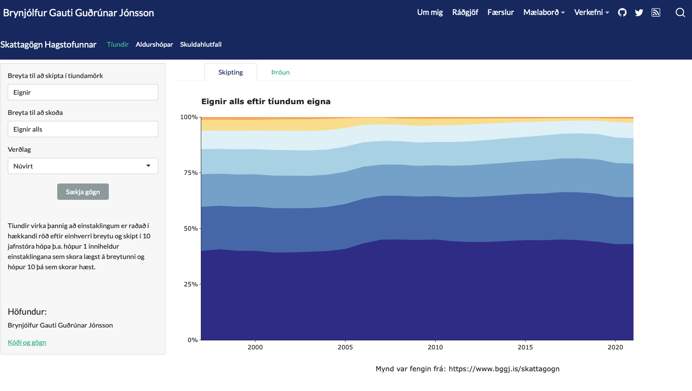

<!-- README.md is generated from README.Rmd. Please edit that file -->

# Skattagögn Hagstofunnar

Þetta er github síðan fyrir [mælaborðið mitt sem má finna á heimasíðu
minni](https://bggj.is/pages/skattagogn).

Hérna tek ég saman allar helstu upplýsingarnar sem má finna í gögnum
Hagstofu um [skuldir, eignir og eiginfjárstöðu heimila úr
skattframtölum](https://hagstofa.is/talnaefni/samfelag/lifskjor/skuldir-og-eignir/)
